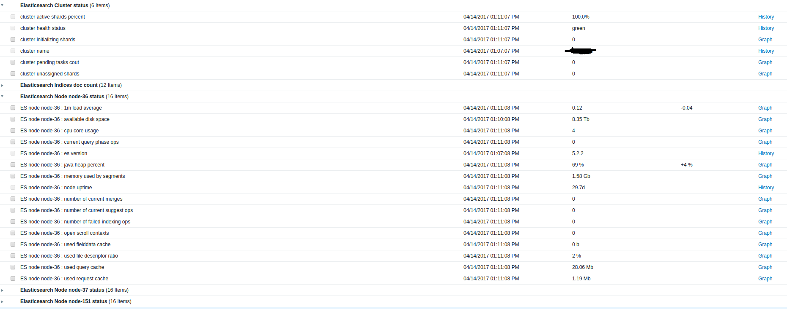

# Elasticsearch monitor scripts for zabbix

这是一个关于ES监控的zabbix的脚本.

**预览**

**特性**

1. 这个监控脚本是使用bash编写的.
2. 只需要Linux的基本工具, 无需其他开发语言的依赖.
3. 只要配置一个节点即可在zabbix上监控整个ES集群,这相当的省事方便,
就算以后调整了集群节点也不需要再重新配置监控.

**依赖环境**

- Linux
- zabbix3
- bash
- linux commands: curl, awk, grep, sort, uniq, sed ...
- support es version 2.x 5.x

**安装指南**

1. 将模板文件 zbx\_templates\_es\_cluster.xml 导入到zabbix.
2. 复制整个 elasticsearch_monitor 目录到任意一个ES节点的 zabbix agentd scripts 目录中(注意zabbix执行权限问题).
3. 修改 es\_env.sh 的配置,指定es节点地址, 建议至少加两个以上节点的地址以防单个节点挂掉监控不到数据.
4. 复制 userparameter_elasticsearch.conf 到 zabbix agentd etc, 注意修改对应的脚本路径.
5. 在zabbix web中添加 "Elasticsearch Cluster" 模板到配置监控脚本的节点.
6. 重启监控节点的zabbix agentd 搞定.

# 关于

* Author: vastxiao.github.io
* Date: 2017.04.11
* Update: 2017.05.05
* Repo: https://github.com/Vastxiao/zabbixMonitorES

